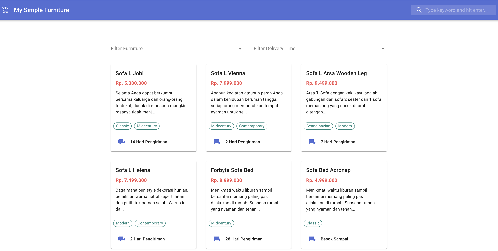

### My Furniture

**Follow the steps below:**
1. You can clone this project (use HTTPS) and run `git clone https://github.com/dodimoop/myfurniture.git` on your terminal
2. Move to inside project folder `cd furniture`
3. Install all dependencies, and run `yarn` on your terminal
4. Run `yarn dev` on your terminal and then open [http://localhost:3000](http://localhost:3000) to view it in the browser.

Thank you :)
